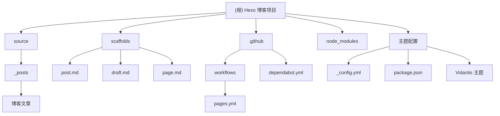

# CLAUDE.md

This file provides guidance to Claude Code (claude.ai/code) when working with code in this repository.

## 变更记录 (Changelog)

- **2025-10-14**: 自适应架构师初始化，生成完整项目结构图和模块文档
- **Previous**: 初始基础配置

## 项目愿景

基于 Hexo 静态博客生成器的个人技术博客站点，使用 Volantis 主题，通过 GitHub Actions 自动部署到 GitHub Pages，专注于分享技术教程、工具使用经验和开发心得。

## 架构总览



## 模块索引

| 模块 | 路径 | 类型 | 职责 | 状态 |
|------|------|------|------|------|
| **站点核心** | `./` | Hexo 站点 | 博客生成引擎配置与管理 | ✅ 已配置 |
| **内容管理** | `source/` | 内容存储 | 博客文章与静态资源管理 | ✅ 活跃 |
| **模板系统** | `scaffolds/` | 模板 | 文章、草稿、页面模板 | ✅ 已配置 |
| **CI/CD** | `.github/` | 自动化 | GitHub Actions 部署流程 | ✅ 运行中 |

## 运行与开发

### 本地开发环境
```bash
# 安装依赖
npm install

# 启动开发服务器
npm run server
# 访问 http://localhost:4000

# 创建新文章
hexo new "文章标题"

# 生成静态文件
npm run build

# 清理缓存
npm run clean
```

### 部署流程
- **自动部署**: 推送到 `master` 分支触发 GitHub Actions
- **手动触发**: GitHub Actions 页面手动执行
- **部署目标**: GitHub Pages (`https://SVEN-chr.github.io/myblog`)

## 测试策略

### 本地验证
1. **文章预览**: 本地服务器实时预览
2. **构建测试**: `npm run build` 验证静态文件生成
3. **链接检查**: 确保所有内部链接正常

### 部署验证
1. **GitHub Actions**: 监控构建日志
2. **线上访问**: 验证部署后的网站功能
3. **SEO 检查**: 确认元数据正确设置

## 编码规范

### 文章写作规范
```markdown
---
title: "文章标题"
date: YYYY-MM-DD HH:mm:ss
tags: [标签1, 标签2]
categories:
  - 分类
  - 子分类
toc: true
---

文章摘要...

正文内容...
```

### 文件命名规范
- **文章**: `YYYY-MM-DD-title.md`
- **图片**: 使用相对路径，存放于对应文章目录
- **资源**: 遵循 Hexo 资源文件夹规范

### Git 提交规范
- `feat`: 新功能或新文章
- `fix`: 修复问题或错误
- `docs`: 文档更新
- `style`: 样式或格式调整
- `refactor`: 代码重构
- `chore`: 构建过程或辅助工具的变动

## AI 使用指引

### 内容生成建议
1. **技术文章**: 侧重实际操作和问题解决
2. **教程编写**: 包含完整的步骤和代码示例
3. **踩坑记录**: 详细描述问题现象和解决方案
4. **工具评测**: 基于实际使用体验

### 文档维护
1. **定期更新**: 保持技术内容的时效性
2. **链接检查**: 避免死链和失效资源
3. **分类管理**: 维护标签和分类的一致性
4. **SEO 优化**: 合理设置关键词和描述

## 开发工具集成

### 主题配置
- **Volantis 主题**: 功能丰富的现代化主题
- **自定义样式**: 通过 `_config.yml` 中的 `theme_config` 配置
- **插件支持**: 搜索、评论、统计等功能扩展

### 自动化工具
- **Dependabot**: 自动更新依赖包
- **GitHub Actions**: 自动构建和部署
- **Node.js 22**: 最新的运行环境支持

## 常见问题与解决方案

### 本地开发问题
1. **端口占用**: 修改 `hexo server -p 4001`
2. **渲染问题**: 确保安装 `hexo-renderer-pug` 和 `hexo-renderer-stylus`
3. **缓存问题**: 运行 `hexo clean` 清理缓存

### 部署问题
1. **构建失败**: 检查 Node.js 版本和依赖安装
2. **权限错误**: 确认 GitHub Pages 权限设置
3. **样式丢失**: 检查 `_config.yml` 中的 `url` 配置

## 扩展功能建议

### 可集成功能
1. **评论系统**: Giscus, Waline, Utterances
2. **统计分析**: Google Analytics, Cloudflare Analytics
3. **搜索功能**: 本地搜索或 Algolia
4. **图片优化**: CDN 集成或图片压缩

### 性能优化
1. **懒加载**: 图片和组件懒加载
2. **CDN 配置**: 静态资源 CDN 加速
3. **缓存策略**: 浏览器缓存和 CDN 缓存优化
4. **压缩优化**: CSS/JS 文件压缩

## 相关资源

- [Hexo 官方文档](https://hexo.io/docs/)
- [Volantis 主题文档](https://volantis.js.org/)
- [GitHub Pages 文档](https://pages.github.com/)
- [Markdown 语法指南](https://www.markdownguide.org/)

---

*最后更新: 2025-10-14*