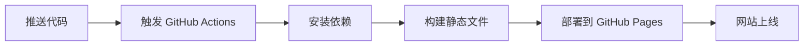

# 📝 我的 Hexo 博客

> 基于 Hexo 静态博客框架构建的个人技术博客，使用 Volantis 主题，通过 GitHub Actions 自动部署到 GitHub Pages。

## 🌟 博客特色

- **🚀 极速构建**：基于 Hexo 8.0.0，静态文件生成速度飞快
- **🎨 Volantis 主题**：功能丰富的现代化主题，支持深色模式、响应式设计
- **🤖 自动部署**：使用 GitHub Actions 实现提交即自动部署
- **📱 移动友好**：完全响应式设计，支持各种设备
- **⚡ 性能优化**：懒加载、代码高亮、搜索功能

## 📂 项目结构

```
myblog/
├── _config.yml              # Hexo 主配置文件
├── package.json             # 项目依赖和脚本
├── source/                   # 源文件目录
│   ├── _posts/              # 博客文章
│   └── categories/          # 分类页面
├── themes/                   # 主题文件
├── public/                   # 生成的静态文件
├── .github/
│   └── workflows/           # GitHub Actions 工作流
│       └── pages.yml        # 自动部署配置
├── scaffolds/               # 文章模板
└── CLAUDE.md               # Claude Code 工作指南
```

## 🛠️ 技术栈

| 技术 | 版本 | 说明 |
|------|------|------|
| **Hexo** | 8.0.0 | 静态博客生成器 |
| **Node.js** | 22 | 运行环境 |
| **Volantis** | 5.8.1 | 主题框架 |
| **GitHub Actions** | - | 自动化部署 |
| **GitHub Pages** | - | 静态网站托管 |

## 🚀 快速开始

### 环境要求

- Node.js >= 22
- Git
- npm

### 本地开发

```bash
# 克隆仓库
git clone https://github.com/SVEN-chr/myblog.git
cd myblog

# 安装依赖
npm install

# 启动开发服务器
npm run server

# 访问 http://localhost:4000
```

### 常用命令

```bash
# 新建文章
npm run new "文章标题"

# 本地预览
npm run server

# 生成静态文件
npm run build

# 清理缓存
npm run clean

# 自动部署（通过 GitHub Actions）
git push origin master
```

## 📝 写作指南

### 新建文章

```bash
# 创建新文章
hexo new "文章标题"

# 创建草稿
hexo new draft "草稿标题"

# 发布草稿
hexo publish "草稿标题"
```

### 文章格式

每篇文章需要包含 Front Matter：

```markdown
---
title: "文章标题"
date: 2025-10-13 14:00:00
tags: [标签1, 标签2]
categories:
  - 分类
  - 子分类
toc: true
---

文章内容...
```

## 🤖 自动部署

本项目使用 GitHub Actions 实现自动化部署：

1. **触发条件**：推送代码到 `master` 分支
2. **构建环境**：Ubuntu + Node.js 22
3. **部署目标**：GitHub Pages
4. **访问地址**：https://SVEN-chr.github.io/myblog

### 部署流程



## 🛠️ 主题配置

本博客使用 Volantis 主题，主要特性：

- ✨ 深色模式支持
- 📱 响应式设计
- 🔍 内置搜索功能
- 💬 评论系统集成
- 📊 访问统计
- 🏷️ 标签云和分类
- 🧑‍💻 代码高亮

### 自定义配置

主题配置文件：`_config.yml`

```yaml
# 站点信息
title: 你的博客标题
subtitle: 副标题
description: 博客描述
author: 作者名

# 主题设置
theme: volantis

# URL 配置
url: https://SVEN-chr.github.io/myblog
```

## 📚 文章分类

### 主要分类

- **技术**：编程技术、工具使用、问题解决
- **博客**：建站经验、主题配置、功能优化
- **故障排查**：踩坑记录、问题解决、经验总结

### 标签系统

常用标签：
- Hexo
- GitHub Actions
- Node.js
- 部署
- 踩坑
- 教程

## 🔧 开发指南

### 本地调试

```bash
# 清理并重新生成
npm run clean && npm run build

# 启动开发服务器（监听文件变化）
npm run server

# 生成并部署到测试环境
npm run build && npm run deploy
```

### 文章发布流程

1. 本地编写文章
2. 预览检查效果
3. 提交代码
4. GitHub Actions 自动部署
5. 访问线上版本

## 🐛 常见问题

### Q: 本地运行正常，部署后样式丢失
A: 检查 `_config.yml` 中的 `url` 配置是否正确

### Q: GitHub Actions 部署失败
A: 查看 Actions 日志，常见问题：
- Node.js 版本不兼容
- 依赖安装失败
- 权限配置错误

### Q: 文章图片不显示
A: 确保：
- 图片路径正确
- 使用相对路径
- 图片已上传到 `source/` 目录

## 🤝 贡献指南

欢迎提交 Issue 和 Pull Request！

### 提交规范

- 🐛 Bug Report：详细描述问题现象
- ✨ Feature Request：说明功能需求和使用场景
- 📝 Documentation：改进文档和示例
- 🎨 Style/Theme：主题和样式优化

## 📄 许可证

本项目采用 [MIT License](LICENSE) 许可证。

## 🙏 致谢

- [Hexo](https://hexo.io/) - 强大的静态博客生成器
- [Volantis](https://volantis.js.org/) - 美观的主题框架
- [GitHub Actions](https://github.com/features/actions) - 自动化部署
- [GitHub Pages](https://pages.github.com/) - 免费静态网站托管

## 📞 联系方式

- GitHub：[@SVEN-chr](https://github.com/SVEN-chr)
- 博客：https://SVEN-chr.github.io/myblog

---

⭐ 如果这个项目对你有帮助，请给个 Star！